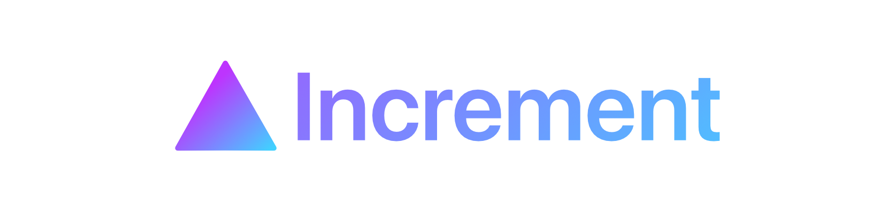
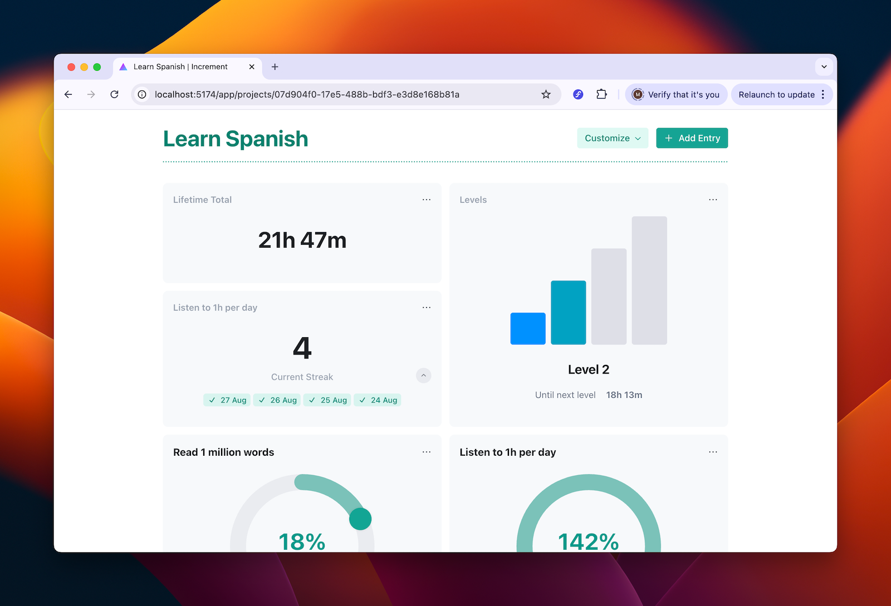
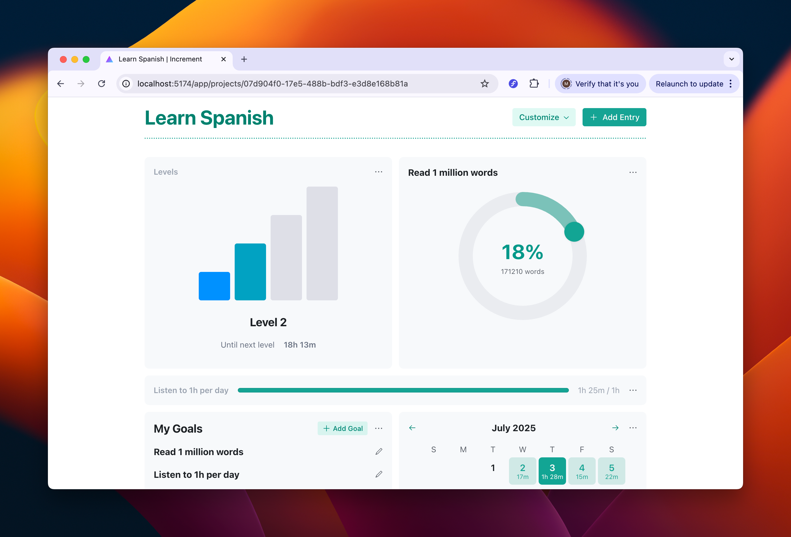
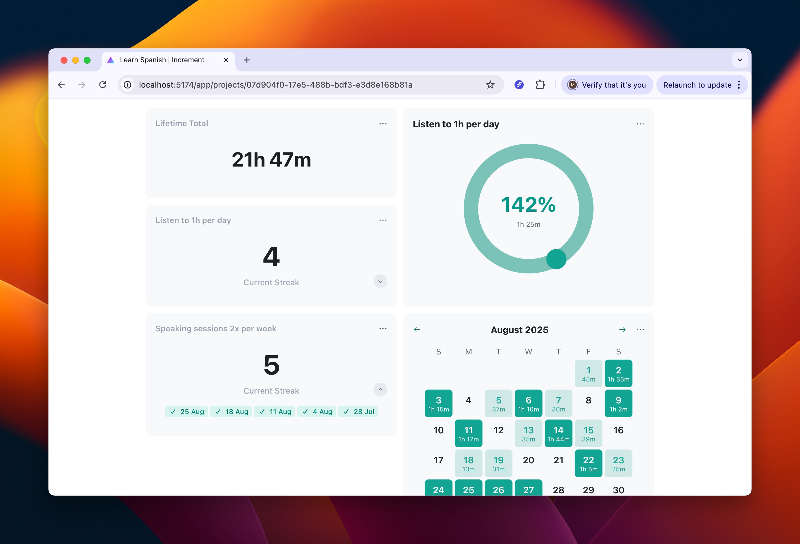
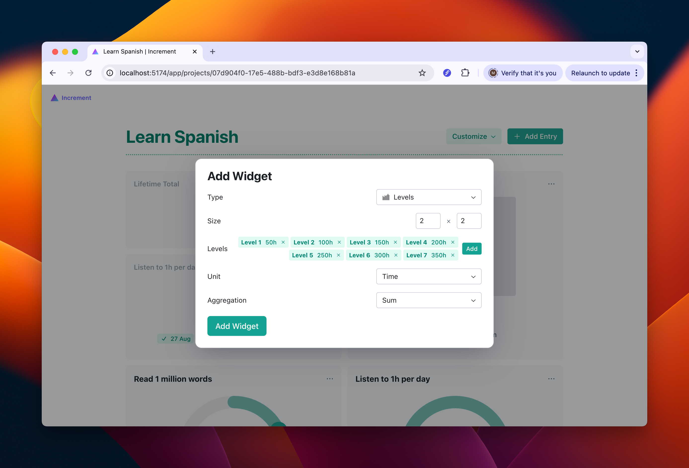
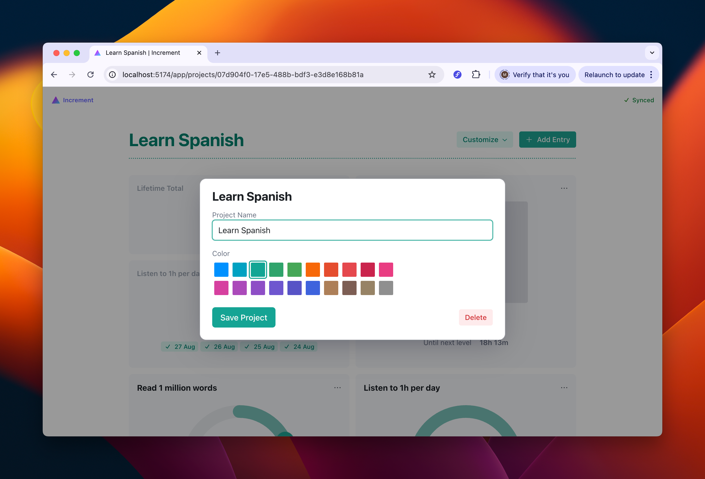
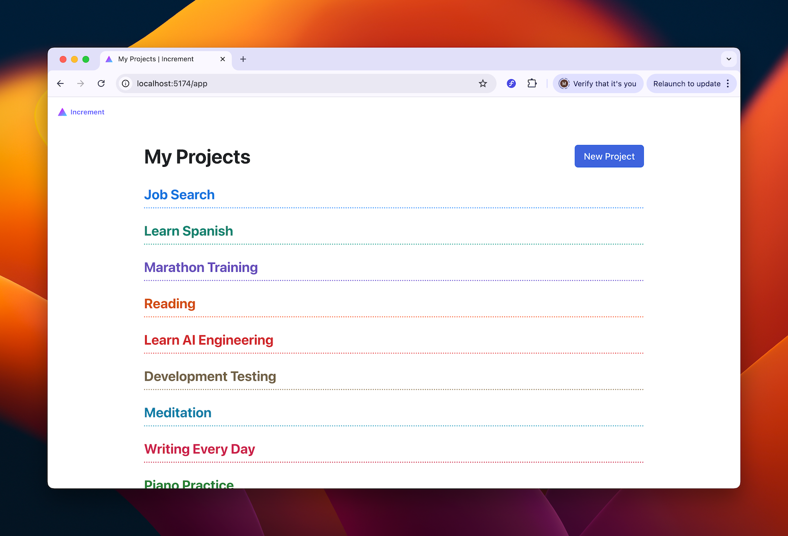

# Increment

**A powerful offline-first goal and progress tracker with advanced customization, real-time sync, and a polished React UI.**  

<!--  -->

## Tech Stack

- ✨ **Frontend:** React, TypeScript, Vite, Tailwind, Radix UI, Framer Motion  
- 📊 **State & Data:** TanStack Query, TanStack Router, IndexedDB (Dexie)  
- 🏗️ **Architecture:** Offline-first with custom sync engine (CloudKit in production; pluggable for serverless/cloud backends or a REST API)  
- 🛠️ **Tooling:** Vitest, React Testing Library (unit + integration test coverage) 

## Key Technical Features

* **Offline-first architecture** with IndexedDB local persistence and sync backends  
* **Custom sync engine** with plug-in architecture, conflict/race condition handling, and offline support
* **High-performance UI** with optimistic UI updates, Radix UI components, and Framer Motion animations  
* **Thorough test coverage** unit and integration tests

## Screenshots








## Product Features

* Cross-platform goal and progress syncing (only web UI open source)  
* Tracks daily, weekly, and monthly goals with support for different units (time, distance, words, count)  
* Support for levels, thresholds, and streaks  
* Highly customizable dashboard with multiple widgets:
  * Calendar view  
  * Streak tracker  
  * Time-until-goal countdown  
  * Level progression  
  * Total progress aggregations  
* Theming and layout customization

## Future Work

* Setting rest days, weekends
* Configurable time zone and unit defaults  
* Multi-goal dashboard widgets and advanced filtering by tags/notes  
* Better handling to display which sync events have failed
* Refining how units / sessions are handled, e.g. if tracking a run, the user might want to track 
  time spent and distance covered in a single entry

## Get Started

```bash
npm install
npm run dev
npm test
```